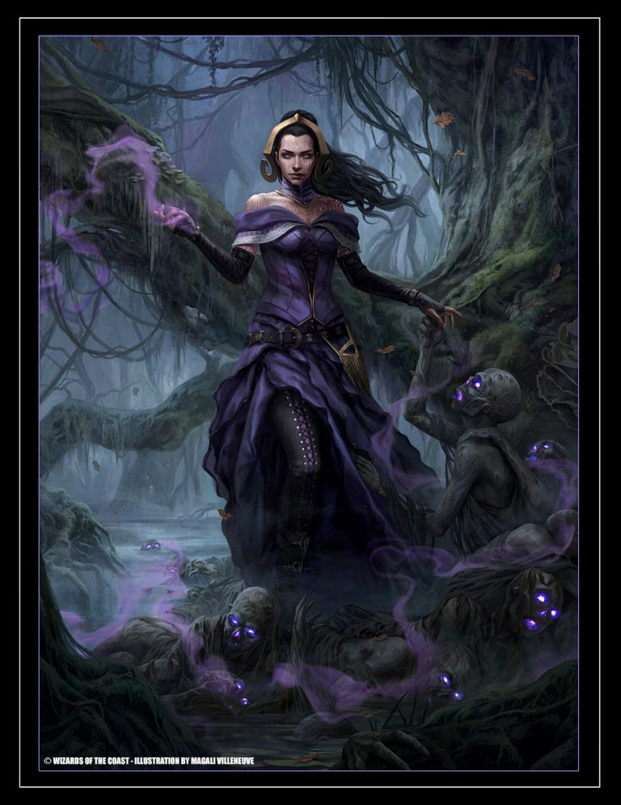

# Lilictocat

[](https://app.sourcelevel.io/github/volcov/lilictocat)
[](https://coveralls.io/github/volcov/lilictocat?branch=master)

**Lilictocat is a simple pull request filter**

## usage

 ```elixir
    Lilictocat.get_oldest_pull_request_without_review()
    # => "https://github.com/dominaria/zoombie/pull/666"

    Lilictocat.get_oldest_pull_request_without_review()
    # => "no pr's to list"
 ```

 #### options

 It is possible to ignore archived repositories with `ignore_archived`

 ```elixir
    Lilictocat.get_oldest_pull_request_without_review(ignore_archived: true)
    # => "https://github.com/dominaria/goblin/pull/132"
 ```  

 ## instalation

 Add Lilictocat to your `mix.exs`:

 ```elixir
 defp deps do
   [
     {:lilictocat, "~> 0.1.0"}
   ]
 end
 ```

After that, run `mix deps.get`.

 you will need to generate a [Github personal API token](https://github.com/blog/1509-personal-api-tokens) with this options

-   repo
-   read:org

After that, add to your `config.exs`

```elixir
config :lilictocat, github_access_token: "your_token"
config :tentacat, :deserialization_options, keys: :atoms
```

NOTE: if running locally, you can export via environment variable
```shell
export LILICTOCAT_TOKEN="xxxxxxxxxxxxxxxxxxxxx"
```

 ## about name

 referencing `Magic The Gathering`

 Liliana Vess is a human planeswalker from Dominaria and is both a master necromancer and a healer, one of her main skills is to revive the dead. And this is the idea of ​​lib, to understand which pull request is in need of more attention, "being revived"

 <p>  </p>

 illustrated by the fantastic [Magali Villeneuve](http://www.magali-villeneuve.com/?p=1457)
